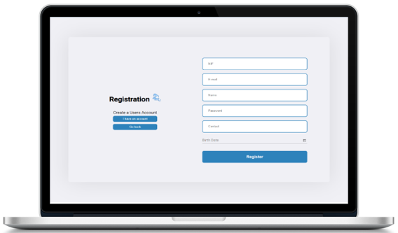

# Test Request Management

<div align="center">


</div>

## 💻Stack

- [Node.js](https://nodejs.org/en/)
- [Express](https://expressjs.com/)
- [Cors](https://www.npmjs.com/package/cors)
- [MongoDB](https://www.mongodb.com/)
- [Angular](https://angular.io/)
- [Angular Material](https://material.angular.io/)


## Backend

### To set up

```
$ npm install
```

### Run

```
$ npm start
```

## Frontend 

### To set up

```
$ npm install
```

### Run

```
$ npm start
```
